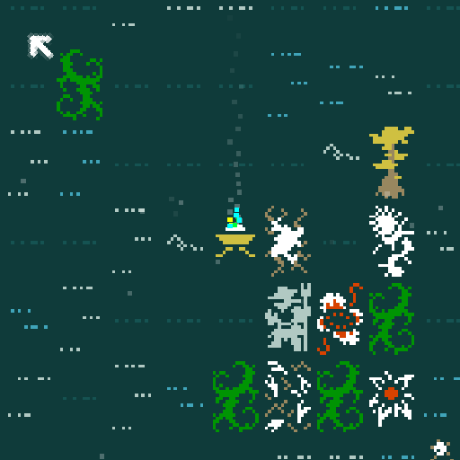

# Piloting Lattice

A data-only Caves of Qud mod for Caves of Qud Modding Jam 5: Burgeoning.

Grow passive vine-chimera bodies with **Burgeoning**, then climb inside them with **Domination**.

## What it does

Piloting Lattice adds five tiers of passive chimeric vine rovers to Burgeoning's plant summoning tables. They are intentionally built as **bodies, not bodyguards**: quiet, low-ego plant chassis that usually stay put until you Dominate them.

Once dominated, a rover becomes a temporary plant-chimera body with custom vine anatomy, natural weapons, Photosynthetic Skin, darkvision, and tier-appropriate combat skills.

## How to play

1. Enable the mod.
2. Play a character with **Burgeoning** and **Domination**.
3. Use Burgeoning to grow a plant patch.
4. Look for a vine rover among the summoned plants.
5. Stand adjacent to the rover and use Domination.
6. Pilot the rover while your original body lies dormant in the garden.

Undominated rovers are defensive and passive by default. They should not follow you around or run off to fight enemies, though adjacent self-defense can still happen.

## Rover tiers

| Rover | Role |
|---|---|
| Twitching rootling | Low-tier scout body; fast and frail, with probing tendrils. |
| Vine husk | Early combat chassis with forked bines, tendrils, and thorns. |
| Braided vine rover | Mid-tier multi-limb body with stronger natural weapons. |
| Knotted vine marionette | High-tier combat chassis with stronger cudgel and short-blade support. |
| Crowned trellis husk | Rare top-tier body; physically powerful, mentally vulnerable. |

## Compatibility

Piloting Lattice is XML/JSON only. It contains no C#, Harmony patches, or DLLs.

It merges new entries into `PlantSummoning1` through `PlantSummoning9`, so it should be compatible with most mods unless they replace or heavily modify the same Burgeoning population tables.

Built for the Caves of Qud 1.0 stable line used by Caves of Qud Modding Jam 5.

## Installation

Copy the mod folder to your Caves of Qud mods directory and enable it from the in-game mod manager.

Typical local mod locations:

- Linux: `~/.config/unity3d/Freehold Games/CavesOfQud/Mods/PilotingLattice/`
- Windows: `%USERPROFILE%\AppData\LocalLow\Freehold Games\CavesOfQud\Mods\PilotingLattice\`
- macOS: `~/Library/Application Support/com.FreeholdGames.CavesOfQud/Mods/PilotingLattice/`

The folder should contain `manifest.json` at its top level.

## Files

- `manifest.json` — mod metadata.
- `ObjectBlueprints/Creatures.xml` — rover creatures, natural weapons, passive AI settings, mutations, and skills.
- `Bodies.xml` — custom chimeric vine anatomies.
- `PopulationTables.xml` — Burgeoning plant summoning table integration.
- `Preview.png` — mod preview image.
- `docs/` — design notes and research references.
- `distribution/` — itch.io / Steam Workshop copy and metadata template.

## Jam timing note

The jam encourages physically creating mod data files during the submission window: **2026-07-01 12:00 UTC to 2026-07-08 12:00 UTC**.

This repository was created after the jam window opened. Its initial commit ports clean concept/design documentation only; the actual mod data files are created in later jam-window commits.

## License

[`LICENSE`](LICENSE) — CC0 1.0 Universal / public domain dedication.

Jam page: <https://itch.io/jam/caves-of-qud-modding-jam-5>
